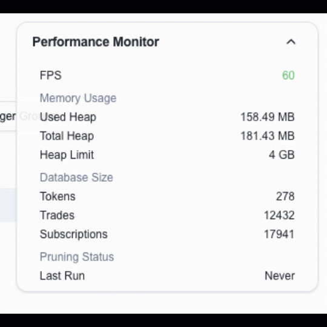

# Pump Fun Analytics - Signal Identifier

A real-time token analytics platform built with Next.js that provides advanced monitoring and analysis capabilities for cryptocurrency tokens. The application features a powerful in-browser database system for efficient data management and a WebSocket-based real-time update system.


## Features

### Real-Time Token Monitoring
- Live token price and volume tracking
- Automatic token discovery and tracking
- Smart watch-list management
- Real-time price alerts and notifications

### Advanced Trigger System
- Configurable trigger conditions
- Watch/Unwatch automation
- Multi-condition evaluation
- Queue-based trigger processing
- Historical trade analysis

### Performance Optimized


The application utilizes an advanced in-browser database system powered by Dexie.js (IndexedDB wrapper) to manage large datasets efficiently while maintaining smooth performance:

- Intelligent data pruning system
- Configurable memory management
- Optimized trade history tracking
- Efficient WebSocket subscription handling
- Background queue processing for triggers

## Technology Stack

- **Frontend**: Next.js 14 with TypeScript
- **State Management**: Custom stores with optimized updates
- **Database**: IndexedDB via Dexie.js
- **Real-time Updates**: WebSocket with automatic reconnection
- **UI Components**: Radix UI with Tailwind CSS
- **Charts**: Lightweight custom charting system

## Getting Started

1. Install dependencies:
```bash
npm install
```

2. Start the development server:
```bash
npm run dev
```

3. Open [http://localhost:3000](http://localhost:3000) in your browser

## Performance Considerations

The application is designed to handle large amounts of real-time data while maintaining responsive performance:

- **Memory Management**: Automatic pruning of historical data to prevent memory bloat
- **Efficient Updates**: Batched state updates to minimize UI re-renders
- **Queue Processing**: Background processing of triggers to maintain UI responsiveness
- **Smart Subscriptions**: Automatic WebSocket subscription management
- **IndexedDB Optimization**: Efficient database queries and indexed lookups

## Browser Support

The application requires a modern browser with support for:
- IndexedDB
- WebSocket
- Web Workers (for background processing)
- ES6+ JavaScript features

## Contributing

Contributions are welcome! Please read our contributing guidelines before submitting pull requests.

## License

MIT License - See LICENSE file for details
